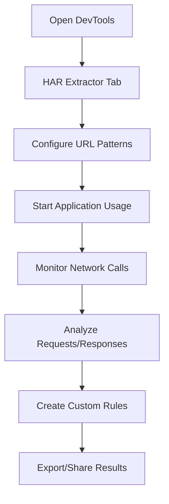

# Conga Bug Analyzer - Chrome DevTools Extension

[](https://chrome.google.com/webstore)
[](https://reactjs.org/)
[](https://typescriptlang.org/)
[](https://vitejs.dev/)

A powerful Chrome DevTools extension designed for debugging and analyzing Conga (Configure, Price, Quote) systems, specializing in Salesforce ApexRemote calls, CongaCloud APIs, and WebSocket connections. Built with React, TypeScript, and modern web technologies.

## 🚀 Features

### Core Functionality
- **🌐 Real-time Network Monitoring**: Capture and analyze HTTP requests and WebSocket messages
- **🔍 Advanced Filtering**: Configurable URL pattern matching for targeted debugging
- **📊 Dual-Panel Analysis**: Compare requests/responses side-by-side
- **🎯 Smart Rules Engine**: Create custom rules to automatically detect specific API responses
- **📈 Historical Data**: Track and compare API call patterns over time
- **🌙 Dark/Light Mode**: Full UI theme support with persistent preferences
- **📋 Export Capabilities**: Copy, save, and share debugging data

### Specialized Tools
- **ApexRemote Debugging**: Parse Salesforce ApexRemote JSON payloads
- **CongaCloud API Analysis**: Monitor REST API calls with endpoint extraction
- **WebSocket Monitoring**: Real-time WebSocket frame inspection
- **JSON Comparison**: Visual diff tool for comparing API responses
- **Log File Analysis**: Upload and parse application log files
- **Field History Tracking**: Monitor specific data field changes across requests

## 📋 Table of Contents

- [Installation](#installation)
- [Project Structure](#project-structure)
- [Getting Started](#getting-started)
- [Core Components](#core-components)
- [Configuration](#configuration)
- [Usage Guide](#usage-guide)
- [Development](#development)
- [Building](#building)
- [Troubleshooting](#troubleshooting)
- [Contributing](#contributing)

## 🛠 Installation

### Prerequisites
- Node.js 16+ and npm
- Google Chrome browser
- Chrome Developer Tools enabled

### Quick Setup
```bash
# Clone the repository
git clone https://github.com/spullela-conga/CPQ-Bug-Analyzer.git
cd CPQ-Bug-Analyzer

# Install dependencies
npm install

# Build the extension
npm run build

# Load in Chrome
# 1. Open Chrome Extensions (chrome://extensions/)
# 2. Enable "Developer mode"
# 3. Click "Load unpacked" and select the project folder
```

### Development Setup
```bash
# Start development server
npm run dev

# The extension will auto-reload on file changes
```

## 📁 Project Structure

```
CPQ-Bug-Analyzer/
├── 📄 manifest.json              # Chrome Extension manifest
├── 📄 devtools.ts               # DevTools integration & network capture
├── 📄 background.js             # Extension background script
├── 📄 panel.html/tsx            # Main DevTools panel entry
├── 📄 index.html/tsx            # Extension popup interface
│
├── 📁 src/
│   ├── 📄 App.tsx               # Main React application router
│   ├── 📄 main.tsx              # React application entry point
│   │
│   ├── 📁 pages/                # Main application pages
│   │   ├── 📄 Home.tsx          # Split-panel comparison interface
│   │   ├── 📄 HarMethodsTabPage.tsx # Primary network monitoring interface
│   │   ├── 📄 Sfdc.tsx          # Salesforce-specific analysis tools
│   │   ├── 📄 Turbo.tsx         # Turbo API analysis tools
│   │   ├── 📄 JsonFormatter.tsx # JSON formatting and beautification
│   │   ├── 📄 CompareJsonPage.tsx # Side-by-side JSON comparison
│   │   ├── 📄 LogAnalyzerPage.tsx # Log file upload and analysis
│   │   └── 📄 HarQueryComponent.tsx # HAR file query interface
│   │
│   ├── 📁 pages/components/     # Reusable UI components
│   │   ├── 📄 NetworkTables.tsx # HTTP & WebSocket data tables
│   │   ├── 📄 DetailPanel.tsx   # Request/response detail viewer
│   │   ├── 📄 UrlPatternSettings.tsx # URL pattern configuration
│   │   ├── 📄 RuleModal.tsx     # Custom rule creation interface
│   │   ├── 📄 MatchesModal.tsx  # Rule match results display
│   │   ├── 📄 EditModal.tsx     # Request editing and re-triggering
│   │   ├── 📄 HistoryModal.tsx  # Historical data browser
│   │   ├── 📄 SearchInput.tsx   # Advanced search functionality
│   │   ├── 📄 FileUploader.tsx  # File upload component
│   │   └── 📄 ResizablePanels.tsx # UI layout management
│   │
│   ├── 📁 hooks/                # Custom React hooks
│   │   ├── 📄 useHarTab.ts      # Network data capture and processing
│   │   ├── 📄 useRules.ts       # Rules engine management
│   │   ├── 📄 useFieldHistory.ts # Field change tracking
│   │   ├── 📄 useEditModal.ts   # Request editing functionality
│   │   └── 📄 useHar.ts         # HAR file processing
│   │
│   └── 📁 utils/                # Utility functions
│       ├── 📄 RulesHelper.ts    # Rule evaluation engine
│       ├── 📄 jsonUtils.ts      # JSON manipulation utilities
│       ├── 📄 clipboard.ts      # Clipboard operations
│       ├── 📄 extract.ts        # Data extraction utilities
│       ├── 📄 log-parser.tsx    # Log file parsing
│       └── 📄 errorHandler.ts   # Error handling utilities
│
├── 📁 Configuration Files
│   ├── 📄 vite.config.ts        # Vite build configuration
│   ├── 📄 tsconfig.json         # TypeScript configuration
│   ├── 📄 tailwind.config.js    # TailwindCSS styling configuration
│   ├── 📄 postcss.config.js     # PostCSS configuration
│   └── 📄 package.json          # Node.js dependencies and scripts
```

## 🏁 Getting Started

### 1. Extension Installation
After building and loading the extension in Chrome:

1. **Open Chrome DevTools** (F12)
2. **Navigate to "HAR Extractor" tab** (new tab created by extension)
3. **Visit your target application** (Salesforce, CongaCloud, etc.)
4. **Start capturing network traffic** automatically

### 2. Basic Usage Flow



### 3. First-Time Setup

#### Configure URL Patterns
1. Click **"URL Pattern Settings"** button
2. Configure patterns for your environment:
   - **ApexRemote**: `apexremote` (for Salesforce)
   - **CongaCloud**: `congacloud` (for Conga APIs)
   - **Custom patterns**: Add your own URL patterns

#### Enable Dark Mode (Optional)
- Toggle the **🌙/☀️ theme switcher** in the top bar
- Preference persists across sessions

## 🧩 Core Components

### 1. Network Monitoring (`devtools.ts`)
**Purpose**: Captures and processes network traffic using Chrome DevTools APIs

**Key Functions**:
- Attaches Chrome debugger to current tab
- Filters network requests based on URL patterns
- Processes WebSocket frames and HTTP requests
- Sends processed data to React application

**Configuration**:
```typescript
// Supported URL pattern types
interface UrlPattern {
  name: string;        // Display name
  pattern: string;     // URL substring to match
  type: 'apex' | 'http' | 'generic';
  enabled: boolean;    // Active state
  description?: string; // Optional description
}
```

### 2. Main Interface (`HarMethodsTabPage.tsx`)
**Purpose**: Primary user interface for network monitoring and analysis

**Features**:
- **Real-time Tables**: HTTP requests and WebSocket messages
- **Search & Filter**: Find specific requests by content
- **Detail Panel**: View request/response data with syntax highlighting
- **Rules Engine**: Create custom detection rules
- **Export Tools**: Copy JSON, save data

**Key Actions**:
- Click any row to view details
- Use search bar for filtering
- Create rules for automatic detection
- Toggle between raw JSON and tree view

### 3. Rules Engine (`useRules.ts`, `RuleModal.tsx`)
**Purpose**: Automatically detect and highlight specific API responses

**How to Create Rules**:
1. Click **"Create Rule"** button
2. Define conditions:
   ```typescript
   {
     fieldPath: "result.status",     // JSON path to field
     operator: "===",                // Comparison operator
     value: "error"                  // Expected value
   }
   ```
3. Specify target methods (comma-separated)
4. Save rule for automatic matching

**Operators Supported**:
- `===` - Exact match
- `!==` - Not equal
- `includes` - Contains substring
- `>`, `<`, `>=`, `<=` - Numeric comparisons

### 4. Data Analysis Tools

#### JSON Formatter (`JsonFormatter.tsx`)
- Beautify and validate JSON
- Syntax highlighting
- Error detection and highlighting

#### JSON Comparison (`CompareJsonPage.tsx`)
- Side-by-side diff view
- Highlights additions, deletions, modifications
- Support for large JSON objects

#### Log Analyzer (`LogAnalyzerPage.tsx`)
- Upload log files (txt, log formats)
- Parse and extract structured data
- Search and filter log entries

### 5. Request Editor (`EditModal.tsx`)
**Purpose**: Modify and re-send API requests for testing

**Features**:
- Edit request payload
- Modify headers and parameters
- Re-trigger requests with changes
- Compare original vs modified responses

## ⚙️ Configuration

### URL Pattern Management
Access via **"URL Pattern Settings"** button:

#### Default Patterns
```javascript
// ApexRemote (Salesforce)
{
  name: "ApexRemote",
  pattern: "apexremote",
  type: "apex",           // Extracts method from JSON payload
  enabled: true
}

// CongaCloud (REST APIs)
{
  name: "CongaCloud", 
  pattern: "congacloud",
  type: "http",           // Uses HTTP method + endpoint
  enabled: true
}
```

#### Adding Custom Patterns
1. Click **"Add New Pattern"**
2. Configure:
   - **Name**: Display identifier
   - **Pattern**: URL substring to match
   - **Type**: Processing method (apex/http/generic)
   - **Description**: Optional documentation

#### Pattern Types Explained
- **`apex`**: Parses JSON payload for method name (Salesforce ApexRemote)
- **`http`**: Combines HTTP method + endpoint (REST APIs)
- **`generic`**: Basic processing for other API types

### Data Storage
- **localStorage**: URL patterns, user preferences, dark mode
- **Session Storage**: Current session data, temporary filters
- **No external servers**: All data stays in browser

## 📖 Usage Guide

### Monitoring API Calls

#### 1. Basic Monitoring
```bash
# Start monitoring
1. Open target application
2. Open DevTools → HAR Extractor tab
3. Perform actions in application
4. View captured requests in real-time
```

#### 2. Filtering and Search
```typescript
// Search examples
"error"           // Find requests containing "error"
"status:200"      // Find successful requests
"method:POST"     // Find POST requests
"endpoint:user"   // Find user-related endpoints
```

#### 3. Advanced Analysis
- **Click request row** → View detailed request/response
- **Right-click** → Copy JSON, export data
- **Search within response** → Use Ctrl+F in detail panel
- **Compare responses** → Use history modal

### Creating Detection Rules

#### Example: Error Detection Rule
```javascript
// Rule configuration
{
  conditions: [
    {
      fieldPath: "result.success",
      operator: "===", 
      value: "false"
    },
    {
      fieldPath: "result.errors",
      operator: "!==",
      value: ""
    }
  ],
  methodNames: "updateAccount,createOrder,processPayment"
}
```

#### Example: Performance Monitoring
```javascript
// Detect slow responses
{
  conditions: [
    {
      fieldPath: "duration", 
      operator: ">",
      value: "5000"  // 5 seconds
    }
  ],
  methodNames: "*"  // All methods
}
```

### Working with WebSocket Data

#### Monitoring WebSocket Frames
- **Automatic capture** of WebSocket messages
- **Direction indicators**: Sent/Received
- **Payload parsing**: JSON structure extraction
- **Filtering**: Exclude heartbeat messages

#### WebSocket Analysis
```typescript
// WebSocket message structure
{
  endpoint: "TaskId: 12345",
  action: "subscribe", 
  payload: {...},      // Parsed JSON content
  direction: "sent",   // sent/received
  timestamp: 1640995200000
}
```

### Data Export and Sharing

#### Copy Options
- **Copy JSON**: Raw request/response data
- **Copy URL**: Request endpoint
- **Copy Headers**: HTTP headers
- **Copy Payload**: Request body only

#### Export Formats
- JSON files
- CSV exports (for tabular data)
- Text summaries
- HAR file generation

## 🔧 Development

### Development Environment Setup
```bash
# Install dependencies
npm install

# Start development server (with hot reload)
npm run dev

# Build for production
npm run build

# Type checking
npx tsc --noEmit
```

### Project Technologies
- **Frontend**: React 18.2.0 + TypeScript 5.0.0
- **Build Tool**: Vite 5.0.0 (fast development and building)
- **Styling**: TailwindCSS (utility-first CSS framework)
- **State Management**: React Hooks + Context
- **Chrome APIs**: DevTools, Debugger, Tabs, Storage
- **Utilities**: UUID, React Hot Toast, Framer Motion

### Code Organization

#### Hooks Pattern
Custom hooks encapsulate complex logic:
```typescript
// useHarTab.ts - Network data management
// useRules.ts - Rules engine logic  
// useFieldHistory.ts - Field tracking
// useEditModal.ts - Request editing
```

#### Component Structure
```typescript
// Atomic components
components/SearchInput.tsx     // Reusable search
components/DetailPanel.tsx     // Data viewer
components/NetworkTables.tsx   // Data tables

// Page components  
pages/HarMethodsTabPage.tsx   // Main interface
pages/CompareJsonPage.tsx     // Comparison tool
pages/JsonFormatter.tsx       // JSON tools
```

#### Utility Functions
```typescript
// utils/RulesHelper.ts - Rule evaluation engine
// utils/jsonUtils.ts - JSON manipulation
// utils/clipboard.ts - Browser clipboard integration
// utils/extract.ts - Data extraction utilities
```

### Extension Architecture

#### Manifest V3 Structure
```json
{
  "manifest_version": 3,
  "permissions": ["tabs", "debugger"],
  "host_permissions": ["<all_urls>"],
  "devtools_page": "devtools.html",
  "background": {"service_worker": "background.js"}
}
```

#### Communication Flow
```
DevTools Script (devtools.ts)
    ↓ Chrome APIs
Chrome Network Events  
    ↓ Message Passing
React Application (panel.tsx)
    ↓ State Management
UI Components
```

### Adding New Features

#### 1. New URL Pattern Type
```typescript
// 1. Update interface in devtools.ts
type PatternType = 'apex' | 'http' | 'generic' | 'newtype';

// 2. Add processing logic
case 'newtype':
  return {
    ...basePayload,
    method: customMethodExtraction(request),
    displayName: `${pattern.name}: ${customName}`
  };

// 3. Update UI components
// UrlPatternSettings.tsx - Add new option
// ProcessRequestByPattern function - Handle new type
```

#### 2. New Rule Operator
```typescript
// 1. Update RulesHelper.ts
const operators = {
  '===': (a, b) => a === b,
  'newOp': (a, b) => customLogic(a, b)  // Add here
};

// 2. Update RuleModal.tsx UI
<option value="newOp">New Operation</option>
```

#### 3. New Export Format
```typescript
// 1. Add to DetailPanel.tsx
const exportAs = (format: 'json' | 'csv' | 'newformat') => {
  switch(format) {
    case 'newformat':
      return convertToNewFormat(data);
  }
};

// 2. Add UI button and logic
```

## 🏗 Building

### Production Build
```bash
# Create optimized build
npm run build

# Output directory: dist/
# Files: manifest.json, panel.html, assets/
```

### Chrome Extension Packaging
```bash
# 1. Build the extension
npm run build

# 2. Load in Chrome (Development)
# Chrome → Extensions → Developer Mode → Load Unpacked (select project folder)

# 3. Package for distribution (Optional)
# Chrome → Extensions → Pack Extension
```

### Build Configuration
```typescript
// vite.config.ts
export default defineConfig({
  plugins: [react()],
  build: {
    outDir: 'dist',
    rollupOptions: {
      input: {
        panel: 'panel.html',
        devtools: 'devtools.html', 
        index: 'index.html'
      }
    }
  }
})
```

## 🐛 Troubleshooting

### Common Issues

#### Extension Not Loading
```bash
# Check Chrome Extensions page
chrome://extensions/

# Verify Developer Mode is enabled
# Look for error messages in extension details
```

#### DevTools Tab Not Appearing
```bash
# Refresh the page after loading extension
# Check browser console for errors
# Verify manifest.json permissions
```

#### Network Requests Not Captured
```bash
# Check URL Pattern Settings
# Ensure patterns match your target URLs
# Verify debugger attachment in browser console
```

#### Rules Not Triggering
```bash
# Check rule conditions syntax
# Verify field paths exist in responses
# Check rule target methods match actual method names
```

### Debug Mode
```typescript
// Enable debug logging in devtools.ts
console.log('🎯 devtools.ts: URL matched pattern:', matchedPattern.name);

// Check browser DevTools console for extension logs
// Look for "HAR_EXTRACTOR" prefixed messages
```

### Performance Issues
```bash
# Large number of requests
# - Increase filtering specificity  
# - Clear data periodically
# - Use search to narrow results

# Memory usage
# - Close unused tabs
# - Refresh DevTools panel
# - Restart browser if needed
```

### Data Not Persisting
```bash
# Check localStorage quota
# Verify URL pattern save operations
# Clear browser data if corrupted:
localStorage.removeItem('har_extractor_url_patterns');
```

## 🤝 Contributing

### Development Workflow
1. **Fork** the repository
2. **Create feature branch**: `git checkout -b feature/amazing-feature`
3. **Make changes** with proper TypeScript types
4. **Test thoroughly** with multiple URL patterns
5. **Commit** with descriptive messages
6. **Submit pull request** with detailed description

### Code Standards
- **TypeScript**: Use strict typing, avoid `any` where possible
- **React**: Functional components with hooks
- **CSS**: TailwindCSS utility classes preferred
- **Naming**: Clear, descriptive variable and function names

### Testing Guidelines
```bash
# Test different scenarios
1. Salesforce ApexRemote calls
2. REST API requests  
3. WebSocket connections
4. Large JSON payloads
5. Error conditions
6. Dark/light mode switching
```

### Pull Request Template
```markdown
## Description
Brief description of changes

## Type of Change
- [ ] Bug fix
- [ ] New feature  
- [ ] Breaking change
- [ ] Documentation update

## Testing
- [ ] Tested with Salesforce
- [ ] Tested with CongaCloud
- [ ] Tested WebSocket functionality
- [ ] Tested in both light/dark modes

## Screenshots
Include screenshots for UI changes
```

---

## 📄 License

This project is licensed under the MIT License. See LICENSE file for details.

## 🆘 Support

- **Issues**: [GitHub Issues](https://github.com/spullela-conga/CPQ-Bug-Analyzer/issues)
- **Documentation**: This README and inline code comments
- **Chrome Extension Docs**: [Chrome Extension Development](https://developer.chrome.com/docs/extensions/)

## 🔄 Changelog

### Version 1.0.0
- ✅ Initial release
- ✅ ApexRemote and CongaCloud support
- ✅ Real-time network monitoring
- ✅ Rules engine
- ✅ Dark/light mode
- ✅ JSON comparison tools
- ✅ WebSocket monitoring
- ✅ Request editing and re-triggering
- ✅ Configurable URL patterns
- ✅ Data export capabilities

---

**Built with ❤️ for CPQ developers and system integrators**

### 🔍 **Intelligent API Monitoring**
- **Strict Filtering**: Only shows ApexRemote and CongaCloud API calls (filters out force.com/Salesforce.com generic calls)
- **Static Asset Filtering**: Automatically excludes CSS, JS, images, and other static resources
- **Smart Endpoint Extraction**: Displays clean, readable endpoint names for better analysis

### 🎨 **Modern UI & UX**
- **Full Dark Mode**: Complete dark theme with consistent styling across all components
- **Compact Design**: Space-efficient tables and panels for better data density
- **Responsive Layout**: Resizable panels with persistent sizing preferences
- **Accessible Design**: High contrast ratios and keyboard navigation support

### ⚙️ **Customizable URL Patterns**
- **User-Editable Patterns**: Modify URL matching patterns through a dedicated settings modal
- **Persistent Storage**: Pattern preferences saved to localStorage with fallback logic
- **Real-time Updates**: Changes apply immediately without requiring restart
- **Safety Filters**: Built-in validation ensures only ApexRemote and CongaCloud patterns are active

### 🔄 **Robust WebSocket Monitoring**
- **Hybrid Approach**: Attempts Chrome debugger attachment for full WS monitoring
- **Graceful Fallback**: Falls back to network-based monitoring if user cancels debugger prompt
- **Status Feedback**: Real-time status updates showing debugger attachment state
- **Retry Mechanism**: One-click retry for debugger attachment with toast notifications
- **Connection Display**: Clean formatting of WebSocket base URLs in table headers

### 📊 **Advanced Data Analysis**
- **Request/Response Inspection**: Detailed view of payloads with JSON formatting
- **Search & Filter**: Real-time search across all captured data
- **History Tracking**: Field-level change tracking and history modal
- **Export Capabilities**: Copy formatted JSON to clipboard
- **Time Tracking**: Precise timestamps and duration measurements

### 🛠️ **Developer Experience**
- **Error Handling**: Comprehensive error catching and user feedback
- **Performance Optimized**: Efficient data structures and minimal re-renders
- **Extensible Architecture**: Modular component design for easy customization
- **TypeScript Support**: Full type safety and IntelliSense support

## Installation

1. Clone the repository:
   ```bash
   git clone https://github.com/your-username/CPQ-Bug-Analyzer.git
   cd CPQ-Bug-Analyzer
   ```

2. Install dependencies:
   ```bash
   npm install
   ```

3. Build the extension:
   ```bash
   npm run build
   ```

4. Load in Chrome:
   - Open Chrome and navigate to `chrome://extensions/`
   - Enable "Developer mode"
   - Click "Load unpacked" and select the `dist` folder

## Usage

### Basic Operation
1. Open Chrome DevTools (F12)
2. Navigate to the "Conga Analyzer" tab
3. Visit a Salesforce Conga page to start capturing API calls
4. Use the interface to analyze requests, responses, and WebSocket communications

### WebSocket Monitoring
- **Full Monitoring**: Allow debugger access when prompted for complete WebSocket data
- **Fallback Mode**: If debugger access is denied, the extension automatically falls back to network-based monitoring
- **Retry**: Use the retry button in the status bar to attempt debugger reattachment

### Customizing URL Patterns
1. Click the "Settings" button in the header
2. Add or modify URL patterns in the settings modal
3. Use wildcards (*) for flexible pattern matching
4. Changes are saved automatically and apply immediately

### Data Analysis
- **Search**: Use the search box to filter across all captured data
- **Inspect**: Click any row to view detailed request/response data
- **History**: Track field changes over time using the history modal
- **Export**: Copy formatted JSON data to clipboard for external analysis

## Architecture

### Core Components
- **devtools.ts**: Main extension script handling Chrome APIs and message routing
- **HarMethodsTabPage.tsx**: Primary UI component with state management
- **useHarTab.ts**: Custom hook for live data capture and state synchronization
- **DebuggerStatus.tsx**: Status component for WebSocket monitoring feedback

### Data Flow
1. **Network Capture**: Chrome DevTools API captures network requests
2. **Pattern Matching**: User-configurable patterns filter relevant API calls
3. **Data Processing**: Requests are parsed, formatted, and enriched with metadata
4. **UI Updates**: React components receive real-time updates via message passing
5. **User Interaction**: Actions trigger corresponding handlers in the DevTools context

### Storage & Persistence
- **URL Patterns**: Stored in localStorage with validation and fallback logic
- **UI Preferences**: Dark mode and panel sizing preferences persist across sessions
- **Session Data**: Network captures are session-scoped and reset on page reload

## Configuration

### Default URL Patterns
The extension comes with pre-configured patterns for:
- **ApexRemote**: `*/apex/*` - Salesforce Apex remote calls
- **CongaCloud**: `*conga*` - Conga Cloud API endpoints

### Customization Options
- **Dark Mode**: Toggle via header button, preference saved automatically
- **Panel Sizing**: Drag panel borders to resize, sizing persists across sessions
- **Search Scope**: Search applies to all captured data including nested objects
- **Pattern Management**: Add, edit, or remove URL patterns via settings modal

## 🔧 Troubleshooting

### Common Issues and Solutions

#### ❌ "Cannot access a chrome-extension:// URL of different extension"

**Problem**: This error occurs when another Chrome extension is already using the debugger API.

**Solutions** (try in order):
1. **Close conflicting extensions**:
   - Disable other debugging/developer extensions temporarily
   - Common conflicts: React DevTools, Redux DevTools, other network monitoring extensions
   
2. **Restart Chrome process**:
   ```bash
   # Close all Chrome windows and restart
   # Or use Chrome Task Manager (Shift+Esc) to end Chrome processes
   ```

3. **Use a fresh Chrome profile**:
   - Create a new Chrome profile specifically for development
   - Install only essential extensions in the new profile

4. **Check extension load order**:
   - Load this extension first before other debugging tools
   - Reload this extension if it was loaded after conflicting ones

#### ⚠️ Debugger Connection Issues

**Symptoms**: "Reconnect WS" button appears, no network data captured

**Solutions**:
1. **Manual reconnection**: Click the "Reconnect WS" button in the header
2. **Refresh target page**: Reload the page you're debugging
3. **Restart DevTools**: Close and reopen Chrome DevTools
4. **Extension reload**: Reload the extension in chrome://extensions/

#### 🚫 Permission Errors

**Problem**: "Permission denied" or similar access errors

**Solutions**:
1. **Check extension permissions**:
   - Go to chrome://extensions/
   - Find "Conga Bug Analyzer"
   - Ensure "Allow access to file URLs" is enabled (if needed)
   
2. **Verify manifest permissions**:
   ```json
   {
     "permissions": ["tabs", "debugger", "storage"],
     "host_permissions": ["<all_urls>"]
   }
   ```

3. **Reload extension after permission changes**

#### 🔄 Extension Not Loading

**Problem**: Extension appears in DevTools but panel is blank or broken

**Solutions**:
1. **Check console errors**:
   - Open DevTools for DevTools: Ctrl+Shift+I on DevTools window
   - Look for JavaScript errors in console
   
2. **Clear extension data**:
   ```javascript
   // In DevTools console, clear storage:
   localStorage.clear();
   ```

3. **Rebuild from source**:
   ```bash
   npm run build
   # Then reload extension
   ```

#### 📡 Network Data Not Appearing

**Problem**: Extension loads but no network requests are captured

**Solutions**:
1. **Verify URL patterns**:
   - Click the Settings (⚙️) button in header
   - Ensure URL patterns match your target APIs
   - Default patterns: "apexremote", "congacloud"

2. **Check network activity**:
   - Ensure the target page is making matching API calls
   - Look in Chrome DevTools Network tab to verify requests exist

3. **Pattern troubleshooting**:
   ```javascript
   // Check current patterns in DevTools console:
   console.log(localStorage.getItem('har_extractor_url_patterns'));
   ```

#### 🎨 UI/Display Issues

**Problem**: Dark mode not working, layout broken, buttons not responding

**Solutions**:
1. **Theme reset**:
   - Toggle dark/light mode button multiple times
   - Check browser zoom level (should be 100%)

2. **CSS conflicts**:
   - Ensure no other extensions modify DevTools styling
   - Check for browser-level custom CSS

3. **Component refresh**:
   - Refresh the DevTools panel
   - Resize the DevTools window

### Debug Mode

Enable verbose logging for troubleshooting:

1. **Open DevTools for DevTools**: 
   - With DevTools open, press Ctrl+Shift+I (Windows/Linux) or Cmd+Option+I (Mac)

2. **Enable verbose console logging**:
   ```javascript
   // In the DevTools-for-DevTools console:
   localStorage.setItem('har_extractor_debug', 'true');
   ```

3. **Monitor console output**:
   - Look for messages prefixed with emojis: 🔌, 📤, 🔄, etc.
   - These indicate debugger connection, message passing, and reload events

### Getting Help

**Before reporting issues**:
1. Check this troubleshooting section
2. Try solutions in the order listed
3. Gather the following information:
   - Chrome version: `chrome://version/`
   - Extension version: Check chrome://extensions/
   - Console errors: From DevTools-for-DevTools
   - Steps to reproduce the issue

**Reporting bugs**:
1. Open GitHub Issues: [Create New Issue](https://github.com/spullela-conga/CPQ-Bug-Analyzer/issues)
2. Use the bug report template
3. Include all gathered information
4. Attach screenshots if UI-related

## Contributing

1. Fork the repository
2. Create a feature branch: `git checkout -b feature-name`
3. Make your changes with appropriate tests
4. Ensure the build passes: `npm run build`
5. Submit a pull request with a clear description

## License

This project is licensed under the MIT License - see the LICENSE file for details.

## Support

For issues, feature requests, or questions:
1. Check existing GitHub issues
2. Create a new issue with detailed reproduction steps
3. Include Chrome version, extension version, and relevant console logs